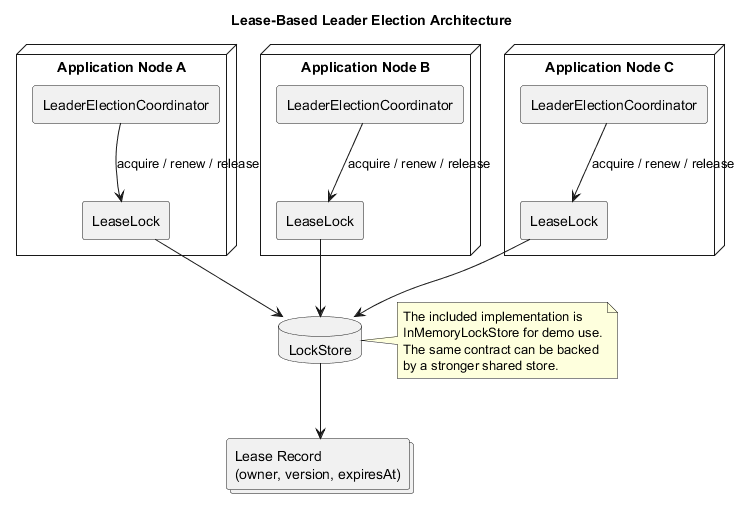
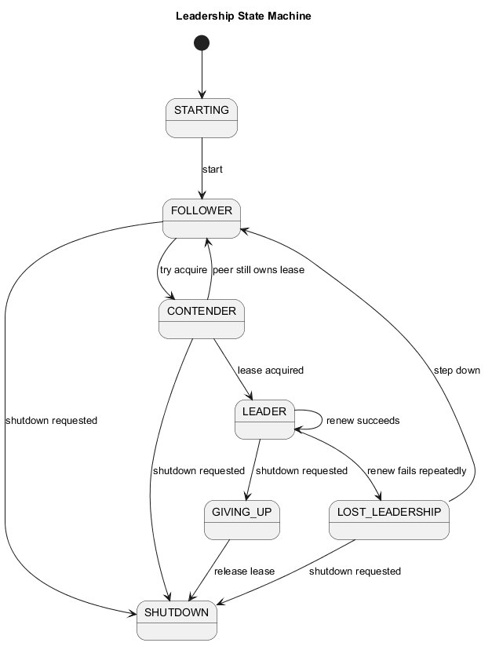
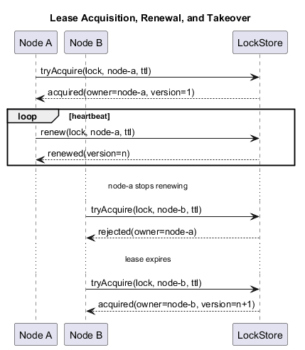

# lease-based-leader-election

A compact Java project that demonstrates lease-based leader election with renewable ownership, heartbeat renewal, retry with backoff, explicit leadership state transitions, and failover takeover.

## Overview

This repository models a high-availability coordination primitive that many distributed systems need: exactly one instance should act as the active leader at a time, while peer instances remain ready to take over when the leader stops renewing its lease.

The implementation is intentionally small but realistic enough to show production-oriented design choices:

- renewable distributed lock semantics
- explicit lease expiration and takeover
- scheduled heartbeat renewal
- retry and backoff while contending
- leadership loss handling
- graceful give-up and shutdown
- deterministic in-memory demo behavior

## Problem Statement

Some workloads should only run on one node at a time:

- a singleton job scheduler
- a settlement worker
- a cache rebuild coordinator
- a workflow dispatcher
- a maintenance owner for cluster-wide operations

Without coordination, multiple nodes can perform the same action concurrently and corrupt shared state. A lease-based election model solves this by granting temporary leadership to a single node. Leadership remains valid only while the node renews its lease before expiration. If renewal stops, another node can safely take over after the lease times out.

## How It Works

### Lease Acquisition

Each node runs a `LeaderElectionCoordinator`. On startup it becomes a follower, transitions into a contender state, and tries to acquire a named `LeaseLock`.

If the lock is free, expired, or already owned by that node, the `LockStore` grants a new `LeaseSnapshot`.

### Heartbeat and Renewal

The leader schedules periodic renewals before the lease TTL expires. Each successful heartbeat extends the expiration time and emits a new lease version.

### Lease Expiration and Takeover

If the leader stops renewing because it crashes, stalls, or shuts down, the lease eventually expires. Followers continue retrying acquisition with backoff. The first follower that sees an expired lease acquires leadership and becomes the new leader.

### Leadership State Transitions

The coordinator uses explicit states instead of a single boolean:

- `STARTING`
- `FOLLOWER`
- `CONTENDER`
- `LEADER`
- `LOST_LEADERSHIP`
- `GIVING_UP`
- `SHUTDOWN`

These states make takeover, renew failure, shutdown, and retry behavior visible in logs and tests.

## Architecture



Core components:

- `LockStore`: backend contract for lease acquisition, renewal, release, and inspection
- `InMemoryLockStore`: single-JVM demo implementation
- `LeaseLock`: node-scoped lease facade
- `LeaderElectionCoordinator`: drives acquisition, heartbeat, retry, leadership loss, and shutdown
- `LeadershipListener`: hook for external actions or metrics
- `LeaderElectionDemo`: starts multiple nodes in one JVM and forces a failover event

## State Transitions



The runtime distinguishes between clean give-up and involuntary leadership loss:

- clean shutdown: `LEADER -> GIVING_UP -> SHUTDOWN`
- renew failure: `LEADER -> LOST_LEADERSHIP -> FOLLOWER -> CONTENDER`
- normal contention: `FOLLOWER -> CONTENDER -> FOLLOWER`

## Lease Lifecycle



## Running the Demo

Requirements:

- Java 8 or higher
- Maven 3.8+

Run the tests:

```bash
mvn test
```

Run the leader-election demo:

```bash
mvn exec:java
```

The demo starts three simulated nodes in one JVM. One becomes leader, renews its lease, and is then stopped intentionally so another node can take over.

## Example Behavior

Typical output looks like this:

```text
[node-a] STARTING -> FOLLOWER (coordinator-started)
[node-b] STARTING -> FOLLOWER (coordinator-started)
[node-c] STARTING -> FOLLOWER (coordinator-started)
[node-a] FOLLOWER -> CONTENDER (attempting-acquire)
[node-a] CONTENDER -> LEADER (lease-acquired)
[node-b] CONTENDER -> FOLLOWER (lease-held-by-peer)
[node-c] CONTENDER -> FOLLOWER (lease-held-by-peer)
... leader renews lease ...
Stopping leader node-a to trigger failover...
[node-a] LEADER -> GIVING_UP (shutdown-requested)
[node-b] FOLLOWER -> CONTENDER (attempting-acquire)
[node-b] CONTENDER -> LEADER (lease-acquired)
```

## Real-World Use Cases

- Active-passive job scheduler where only one instance should trigger batch windows.
- Singleton billing or settlement worker that must avoid duplicate financial side effects.
- Leader-controlled cache rebuild process that should not stampede the backend.
- HA workflow coordinator that assigns or advances long-running processes.
- Cluster-wide maintenance owner responsible for cleanup, retention, or repair work.
- Partition reassignment coordinator that serializes ownership moves during operational events.

## Design Trade-offs

Advantages:

- easy to understand and test
- explicit, inspectable lease ownership
- clear leader-loss semantics
- small surface area that can be backed by a stronger store later

Limitations:

- the included store is in-memory only and is not suitable for multi-process production use
- safety depends on clock assumptions and backend semantics
- there is no fencing token enforcement at the work-consumer layer
- the demo focuses on coordination, not on business workload execution

## Failure Scenarios

### Leader Crashes

The leader stops renewing. Followers keep retrying. Once the lease expires, one follower acquires it and becomes leader.

### Renew Fails

Renew failures are counted. After the configured threshold, the coordinator transitions through `LOST_LEADERSHIP` and returns to follower mode before contending again.

### Lease Expires

An expired lease is treated as free capacity. The next successful contender can take over ownership with a higher lease version.

### Slow Node Comes Back

A slow or paused former leader does not resume work automatically. Its renew attempts are rejected once ownership has moved, and it must re-enter contention as a follower.

## Future Improvements

- add a JDBC or Redis-backed `LockStore`
- introduce fencing tokens at the worker boundary
- export metrics for lease age, renew latency, and election churn
- add jittered exponential backoff
- support pluggable time sources for more deterministic testing